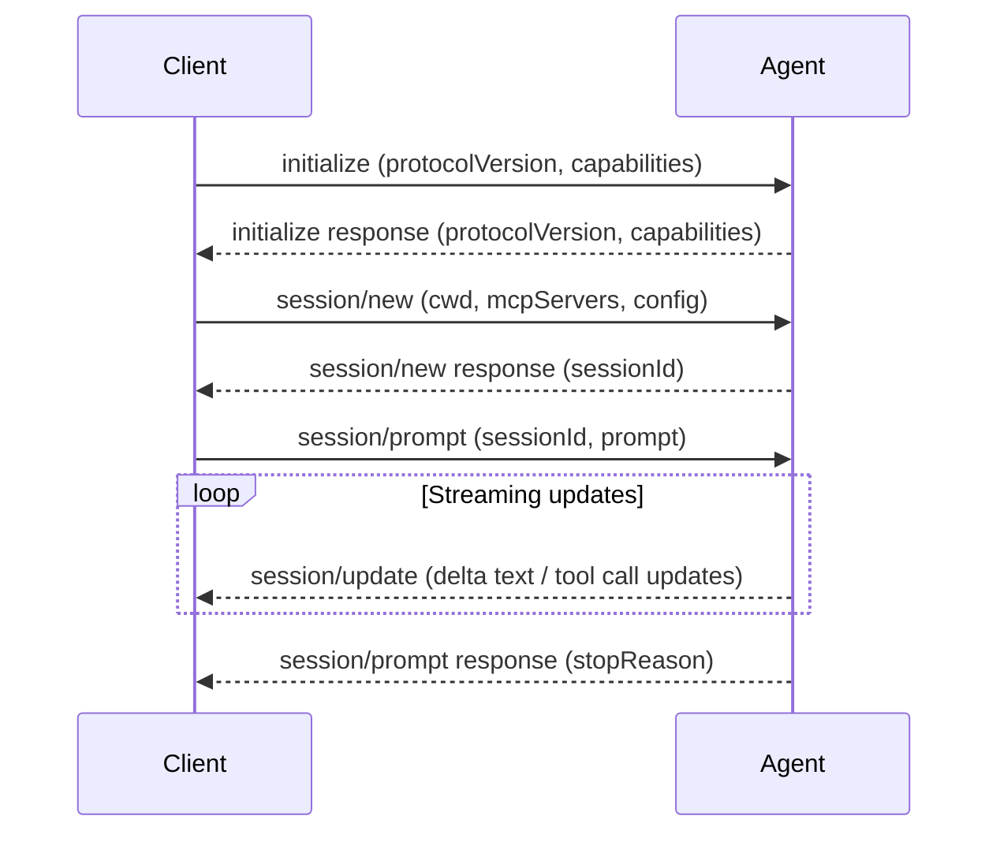

+++
title = "acp"
description = "Expert guidance for Agent Client Protocol (ACP) — building, integrating, or debugging ACP agents and clients, implementing JSON-RPC 2.0 schemas, managing session lifecycles, elicitation, tool calls, v1/v2 migration, and using official SDKs (TypeScript, Rust, Python, Java, Kotlin). Use when working with ACP protocols, building ACP-compatible AI agent servers or client applications, or inspecting ACP specifications and RFDs."
sort_by = "title"
template = "skill.html"
[extra]
skill = true
category = "engineering"
mermaid = true
+++


# Agent Client Protocol (ACP)

The **Agent Client Protocol (ACP)** is an open standardizing protocol (built on JSON-RPC 2.0) that connects code editors and client applications to AI agents. It standardizes communication across sessions, prompts, tool calls, file system access, terminal execution, and structured user input (elicitation).

---

## Protocol Overview

ACP operates over **JSON-RPC 2.0** via newline-delimited JSON over `stdio` (stdin/stdout) or streamable HTTP/WebSocket transports.

- **Request / Response**: Every request carries an integer or string `id` and receives a response with matching `id`.
- **Notifications**: One-way messages without an `id` field (e.g. streaming `session/update` or `session/cancel`).
- **Bidirectional RPC**: Both client and agent can send requests to each other (e.g. client requests agent prompt turn; agent requests client file read or terminal command execution).

---

## Core Connection Lifecycle



### 1. Initialization (`initialize`)

Must be the first request sent by the client upon launching the agent process.

```json
{
  "jsonrpc": "2.0",
  "id": 1,
  "method": "initialize",
  "params": {
    "protocolVersion": 1,
    "clientCapabilities": {
      "fs": {
        "readTextFile": true,
        "writeTextFile": true
      },
      "terminal": true
    },
    "clientInfo": {
      "name": "MyEditor",
      "version": "1.0.0"
    }
  }
}
```

### 2. Session Creation (`session/new`)

Establishes an isolated workspace context.

```json
{
  "jsonrpc": "2.0",
  "id": 2,
  "method": "session/new",
  "params": {
    "cwd": "/path/to/project",
    "mcpServers": []
  }
}
```

### 3. Prompt Turn (`session/prompt`)

Submits user input and begins the prompt lifecycle.

```json
{
  "jsonrpc": "2.0",
  "id": 3,
  "method": "session/prompt",
  "params": {
    "sessionId": "sess_123",
    "prompt": [
      {
        "type": "text",
        "text": "Fix linting errors in src/main.ts"
      }
    ]
  }
}
```

### 4. Response & Streaming Updates (`session/update`)

While processing, the agent emits streaming notifications:

```json
{
  "jsonrpc": "2.0",
  "method": "session/update",
  "params": {
    "sessionId": "sess_123",
    "update": {
      "type": "content_delta",
      "delta": "Checking files..."
    }
  }
}
```

When finished, the agent responds to the original `session/prompt` request with a `stopReason` (`end_turn`, `cancelled`, `max_tokens`).

---

## Session Management & Operations

| Method                            | Type         | Description                                               |
| --------------------------------- | ------------ | --------------------------------------------------------- |
| `session/new`                     | Request      | Create a brand-new session.                               |
| `session/load` / `session/resume` | Request      | Load/resume an existing session by ID and replay history. |
| `session/list`                    | Request      | List existing active and persisted sessions.              |
| `session/close`                   | Request      | Close an active session and release resources.            |
| `session/delete`                  | Request      | Delete session history permanently.                       |
| `session/cancel`                  | Notification | Instantly cancel an ongoing prompt turn.                  |

---

## Protocol Capabilities & RFDs

### Elicitation (Structured User Input)

Agents request structured clarification from users mid-turn via `elicitation/request`.

### Tool Calls & Permissions

Agents declare tool execution attempts (`tool_call`), and clients validate or prompt for user permission before execution.

### Agent Execution Plan (`agent/plan`)

Agents communicate multi-step execution plans and track task progress dynamically.

### Session Configuration (`session/config`)

Dynamically switch models, select options, toggle boolean config flags, or set custom LLM endpoints.

---

## ACP v1 vs. ACP v2 (Draft) Migration

ACP v2 introduces several protocol refinements:

- **Prompt Lifecycle**: Unified event stream replacing discrete update variants.
- **Enhanced Terminal & FS Capabilities**: Richer terminal output streaming and granular diff file states (including deleted files).
- **Plan Variants**: Support for alternative sub-plans and branch choices.
- **Session Resume Replay**: Streamlined history hydration on session resume.

---

## Official SDKs & Ecosystem

- **TypeScript SDK**: `@agentclientprotocol/sdk` (Node.js & browser runtimes)
- **Rust SDK**: `acp` crate (High-performance native implementations)
- **Python SDK**: `acp` package
- **Java / Kotlin SDKs**: First-party JVM client and agent bindings
- **ACP Registry**: Central registry for discovering and installing ACP-compliant agents

---

## Reference Documentation

Detailed specifications and RFD documents are downloaded into `resources/auto/` for deep reference:

- [LLMs Index](resources/auto/llms.txt) — Master listing of all ACP specs, announcements, and RFDs.

