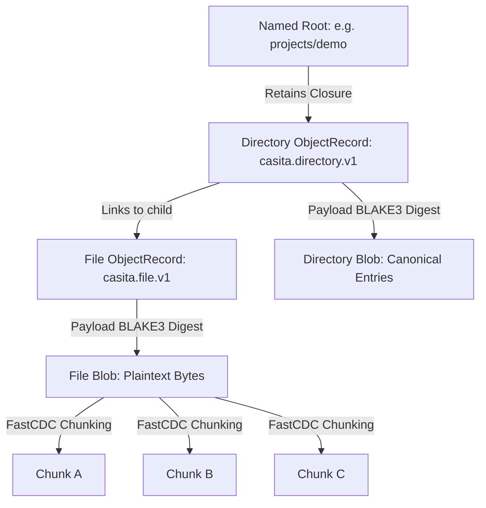

+++
title = "casita"
description = "Operate Casita, the verified content-addressed repository for immutable object graphs, source code, and build artifacts. Use when working with the casita CLI, Rust API (casita::Repository), content-addressed storage, BLAKE3 blob deduplication, canonical directory graphs, roots and retention policies, garbage collection, repository sync, Casitar archives, or importing filesystem, tar, Git, and OCI artifacts."
sort_by = "title"
template = "skill.html"
[extra]
skill = true
category = "engineering"
mermaid = true
+++


# Casita Development and Operations

Casita is a verified content-addressed repository engine for immutable object graphs, source code, and build artifacts. Written in Rust, it modernizes and separates the storage layer of Nix into a standalone system featuring BLAKE3 payload hashing, FastCDC chunk deduplication, canonical directory graphs, verified repository synchronization, and reachability-based garbage collection.

## When to Use This Skill

- Storing, inspecting, checking out, or synchronizing code and build artifacts with the `casita` CLI.
- Developing applications using the supported (`casita::Repository`) or experimental (`casita::experimental::Repository<PS, SS>`) Rust APIs.
- Designing or implementing custom importers, object formats, or storage backends.
- Configuring named roots, retention policies (`permanent` vs `evictable`), and automated garbage collection under disk pressure.
- Packaging or restoring complete closure-verified graphs using portable Casitar (`.casitar`) archives.
- Operating local, SSH, or S3 repositories and verifying repository integrity with `casita fsck`.

---

## 1. Core Architecture and Identity Model

Casita separates byte storage from graph semantics through two distinct identity layers:



### Identity Layers

- **`BlobId`**: The BLAKE3 digest of the complete plaintext bytes. Equal byte streams always share the exact same `BlobId`, regardless of which importer wrote them or how they are chunked or compressed.
- **`ObjectKey`**: A namespace-qualified string identifying a semantic object (e.g., `casita.directory.v1:<blake3>`, native Git commit SHA, or IPLD CID).
- **`ObjectRecord`**: Binds an `ObjectKey` to its physical `BlobId`, payload byte length, and an ordered list of forward retaining links to other objects.
- **`RootName`**: A validated hierarchical name (e.g., `projects/app/v1`, `releases/current`) pointing to one root `ObjectKey`. Roots retain their entire forward reachable closure.

---

## 2. Command-Line Interface (CLI) Workflows

The `casita` CLI operates either on a specified repository (`--repository <PATH>`) or on the default per-user workspace.

### Repository Initialization

```bash
casita --repository ./cache init
```

Initializes the local repository profile, creating `./cache/blobs` for payloads and `./cache/casita.sqlite` for metadata.

### Importing and Checking Out Files

```bash
# Import a local directory under a permanent root
casita --repository ./cache import ./project --root projects/demo

# List direct directory contents by object key or BLAKE3 digest
casita --repository ./cache tree list casita.directory.v1:...

# Materialize a complete directory graph into an empty destination
casita --repository ./cache checkout casita.directory.v1:... ./restored --no-root
```

- When `--root` is omitted during directory import, Casita assigns an automatic name under `auto/`.
- `checkout` creates an `auto/checkout/...` retention root by default to protect restored files from GC; pass `--no-root` to avoid creating this retention pin.
- Repeat imports skip unchanged files by comparing inode, size, and timestamps. Use `--filesystem-rehash` to force a full content re-read.

### Named Roots and Retention Management

```bash
# Set or repoint a root to an object key
casita --repository ./cache root set releases/current casita.directory.v1:...

# Set a root with evictable retention (eligible for disk-pressure GC)
casita --repository ./cache root set cargo/cache casita.directory.v1:... --retention evictable

# Update retention policy on an existing root
casita --repository ./cache root retention cargo/cache permanent

# List all roots (use --long to display retention policies)
casita --repository ./cache root ls --long

# Remove a specific root or a prefix tree
casita --repository ./cache root rm releases/old
casita --repository ./cache root rm --prefix staging/
```

### Repository Synchronization

Sync copies selected objects or roots from a source endpoint to a destination endpoint:

```bash
# Sync a root between two local repositories
casita sync --from ./cache --to ./mirror --root projects/demo

# Incremental sync reusing destination-verified closures
casita sync --from ./cache --to ./mirror --root projects/demo --incremental

# Read metadata from one store and blob bytes from another
casita sync --from ./metadata-store --from-blobs ./blob-store --to ./mirror --root projects/demo

# Sync from an SSH endpoint (requires remote casita in PATH)
casita sync --from ssh://user@remote.host/var/casita --to ./cache --root projects/demo
```

### Garbage Collection and Maintenance

```bash
# Preview collection without modifying repository state
casita --repository ./cache gc --dry-run

# Run active collection (removes unrooted records, then unreferenced blobs/chunks)
casita --repository ./cache gc

# Reclaim space inside sparse packs
casita --repository ./cache vacuum

# Check repository integrity (audits records, closures, manifests, and chunks)
casita --repository ./cache fsck --audit-only
```

- Manual `casita gc` and `vacuum` never delete named roots, including roots marked `evictable`.
- Automated disk pressure: on local profiles, starting a mutation when disk usage exceeds 80% triggers a nonblocking GC pass. If usage remains at or above 75%, it evicts least-recently-used `evictable` roots until usage drops below 75%. Permanent roots are never evicted automatically.

### Running Built Artifacts Directly

```bash
# Run an executable located inside a retained root graph
casita run cargo/builds/uv -- --version
casita run go/builds/server --bin server -- --port 8080
```

`casita run` recursively locates the target binary, materializes the tree into an isolated runtime directory, executes it with the caller's environment and arguments, and cleans up on exit.

---

## 3. Portable Casitar Archives (`.casitar`)

Casitar packages a complete, closure-verified Casita object graph into a single portable binary stream or file for offline transport.

```bash
# Export one or more roots into an archive
casita --repository ./source archive create --root releases/current --output release.casitar

# Inspect structural framing, frame counts, and BLAKE3 digest without opening a repo
casita archive inspect release.casitar

# Verify complete closure and format validity inside an isolated temporary repo
casita archive verify release.casitar

# Import the archive into a destination repository with explicit root mappings
casita --repository ./destination archive import release.casitar --root releases/imported

# Or use the common importer interface
casita --repository ./destination import -i casitar release.casitar --casitar-root releases/imported
```

---

## 4. Supported Rust API

Use the non-generic `casita::Repository` for standard applications:

```rust
use casita::import::BlobImport;
use casita::{ObjectKey, Repository, RootName};

#[tokio::main]
async fn main() -> Result<(), Box<dyn std::error::Error>> {
    // Open a persistent local repository or an ephemeral memory repository
    let repo = Repository::local("./cache").await?;
    // let mem_repo = Repository::memory()?;

    // Import raw bytes as a blob under a named root
    let root = RootName::try_from("data/config")?;
    let payload = b"{\"environment\": \"production\"}\n";
    let key: ObjectKey = repo.import(BlobImport::new(payload.as_slice(), root)).await?;
    println!("Published object key: {key}");

    // Inspect collection without modifying data
    let preview = repo.preview_collection().await?;
    println!("Collectible records: {}", preview.logical_objects);

    // Run garbage collection
    let outcome = repo.collect().await?;
    println!("Collection reclaimed {} bytes", outcome.payload_bytes_deleted);

    Ok(())
}
```

---

## 5. Experimental Rust API (`casita::experimental`)

When building custom storage tiers, specialized backends, or custom mutation loops, enable the `experimental` Cargo feature:

```rust
use casita::experimental::{
    CombinedBlobStore, MemoryBlobStore, MemoryMetadataStore, MutationSession, Repository,
};

#[tokio::main]
async fn main() -> Result<(), Box<dyn std::error::Error>> {
    // 1. Tiered Blob Storage: near tier with fallback to far tier
    let near = MemoryBlobStore::new();
    let far = MemoryBlobStore::new();
    let payloads = CombinedBlobStore::new(near, far);
    let metadata = MemoryMetadataStore::new()?;
    let repo = Repository::new(payloads, metadata);

    // 2. Mutation Sessions: stage payloads before publishing root records
    let mut session = repo.begin_mutation().await?;
    let blob_id = session.stage_blob(b"hello world").await?;
    println!("Staged blob ID: {blob_id}");

    // 3. Logical Collection for shared stores (pruning metadata only)
    let outcome = repo.collect_logical().await?;
    if let Some(rev) = outcome.revision {
        println!("Pruned logical records at revision {rev}");
    }

    Ok(())
}
```

---

## 6. Supported Importers and Formats

| Format / Importer | Namespace                | Input Sources                  | Key Guarantees                                                                                         |
| :---------------- | :----------------------- | :----------------------------- | :----------------------------------------------------------------------------------------------------- |
| **Filesystem**    | `casita.directory.v1`    | Directory paths on disk        | Canonical directory Merkle tree, file executable bit, inline symlinks; does not follow external links. |
| **Tar**           | `casita.directory.v1`    | Uncompressed POSIX tar streams | Streams tar archive directly into directory graph without extracting to disk.                          |
| **Git**           | `git/...`                | Working trees or bare repos    | Preserves native Git object IDs and refs; optional byte-for-byte full-clone pack cache.                |
| **Casitar**       | Multiple (closure union) | `.casitar` binary files/pipes  | Closure-complete offline interchange; atomic destination root publication.                             |
| **OCI**           | Container image layout   | Container registries via HTTPS | Stores layers and config; creates optional merged container rootfs (`--oci-rootfs-root`).              |

---

## 7. Integrity Verification and Error Handling

Casita uses explicit, typed error categories and deterministic integrity checks:

### Error Categories (`RepositoryErrorCategory`)

- `Absent`: Requested object, root, record, or payload not found.
- `InvalidData`: Payload bytes failed identity, canonical encoding, or link validation.
- `ImmutableConflict`: Exact immutable key already exists with different payload or links.
- `StaleRevision`: Compare-and-swap expected an earlier repository revision.
- `DestinationConflict`: Target directory is occupied or non-empty during checkout.
- `Busy`: Nonblocking operation could not acquire required ownership lock.
- `Corrupt`: Committed repository state violates an invariant (detected by `fsck`).

### Verification Guarantees

- **Chunked Reads**: Each FastCDC chunk digest is validated against its `ChunkId` upon fetch.
- **Sequential Reads**: Full sequential read validates the complete `BlobId` (BLAKE3) at EOF.
- **Verified Reads (`open_verified` / `cat --verified`)**: Uses Bao outboards to authenticate blocks before returning bytes to the caller, preventing unauthenticated reads.
- **Integrity Audit (`casita fsck --audit-only`)**: Checks root closures, payload presence, format relations, manifests, and unreferenced residue.

---

## 8. Best Practices and Pitfalls

- **Do use evictable roots for rebuildable build caches**: Keep intermediate compilation caches (e.g. Cargo `target/`) under `--retention evictable` so disk-pressure GC can reclaim space automatically.
- **Do use `--no-root` on temporary checkouts**: By default, `casita checkout` registers an `auto/checkout/...` root to prevent GC. Pass `--no-root` when checking out ephemeral build trees.
- **Do use Bao verified reads when authentication is required upfront**: Standard sequential reads verify the complete BLAKE3 hash at EOF. If an operation seeks or aborts early, use `open_verified`.
- **Do use `collect_logical()` when sharing payload backends**: When several repositories share one blob store (e.g. multi-tenant S3), use logical collection so one repository does not delete blobs still needed by another.
- **Don't mutate metadata databases directly**: Never edit `casita.sqlite` or WAL files directly with external tools; always perform operations through the `casita` CLI or Rust API.
- **Don't ignore destination mapping in Casitar imports**: Casitar archives never guess destination root names. Always explicitly specify `--casitar-root` or `--casitar-root-prefix`.

---

## 9. Further Reference and Detailed Guides

The following in-depth guides are vendored under `resources/auto/`:

- **CLI and Commands**: [CLI Reference](@/skills/engineering/casita/resources/auto/reference-cli-index.md) and [Quick Start](@/skills/engineering/casita/resources/auto/getting-started-index.md)
- **Rust APIs**: [Rust API Reference](@/skills/engineering/casita/resources/auto/reference-rust-api-index.md) and [Experimental Rust API](@/skills/engineering/casita/resources/auto/reference-experimental-rust-api-index.md)
- **Concepts and Architecture**: [Concepts Overview](@/skills/engineering/casita/resources/auto/concepts-index.md), [Blob Storage](@/skills/engineering/casita/resources/auto/concepts-blob-storage-index.md), [Directory Storage](@/skills/engineering/casita/resources/auto/concepts-directory-storage-index.md), and [Division of Responsibilities](@/skills/engineering/casita/resources/auto/concepts-responsibilities-index.md)
- **Lifecycle and Maintenance**: [Roots and Retention](@/skills/engineering/casita/resources/auto/concepts-roots-and-retention-index.md), [Garbage Collection](@/skills/engineering/casita/resources/auto/concepts-garbage-collection-index.md), and [Shared Payload Services](@/skills/engineering/casita/resources/auto/concepts-shared-payload-services-index.md)
- **Synchronization and Transport**: [Sync Guide](@/skills/engineering/casita/resources/auto/guides-sync-index.md) and [Casitar Archives](@/skills/engineering/casita/resources/auto/guides-casitar-index.md)
- **Integrations and Operations**: [Operations Guide](@/skills/engineering/casita/resources/auto/guides-operations-index.md), [Cargo Integration](@/skills/engineering/casita/resources/auto/integrations-cargo-index.md), and [Local IPC](@/skills/engineering/casita/resources/auto/integrations-ipc-index.md)
- **Integrity and Errors**: [Errors and Integrity](@/skills/engineering/casita/resources/auto/reference-errors-index.md) and [Object Formats](@/skills/engineering/casita/resources/auto/reference-object-formats-index.md)
- **Complete Docs**: [Full Documentation](resources/auto/llms-full.txt)

