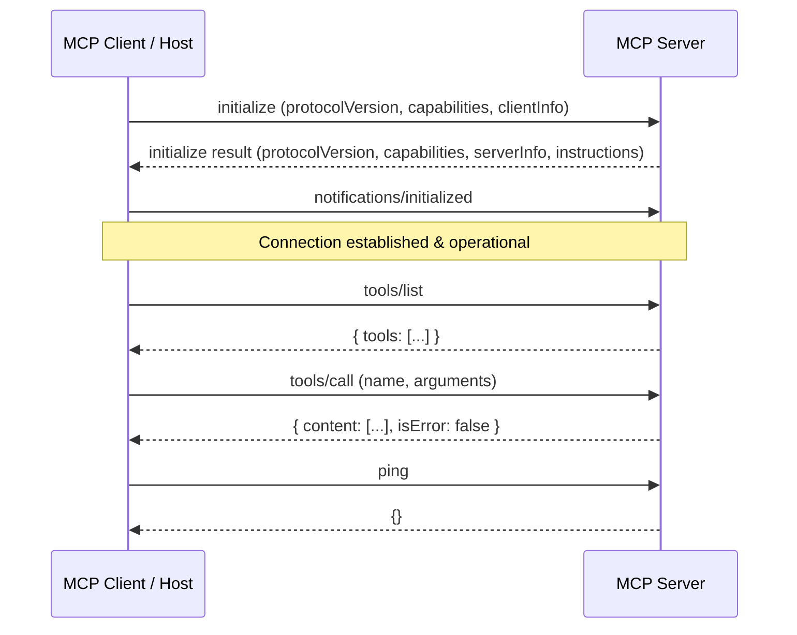

<!-- cspell:ignore Pydantic modelcontextprotocol fastmcp -->

# Model Context Protocol (MCP) - Server Development

The **Model Context Protocol (MCP)** is an open standard protocol based on JSON-RPC 2.0 that allows AI clients and host applications (such as Claude Desktop, OpenCode, Goose, and IDEs) to securely discover and invoke tools, read contextual resources, and load prompt templates exposed by an **MCP Server**.

This skill provides expert guidance for **building and architecting MCP servers** (not client hosts).

---

## When to Reach for This Skill

- Designing and building new MCP servers from scratch in TypeScript, Python, Kotlin, or Go.
- Defining MCP **tools** with strict parameter schemas (JSON Schema 2020-12 / Zod / Pydantic) and handling tool invocation errors properly.
- Exposing static or dynamic **resources** via URI schemes, implementing resource templates, and broadcasting change notifications or handling subscriptions.
- Exposing pre-built **prompts** with typed argument validation and autocompletion.
- Implementing MCP connection lifecycles: protocol negotiation, capabilities exchange, ping, and cancellation.
- Configuring transports: `stdio` (with standard I/O safety) vs. Streamable HTTP / Server-Sent Events (SSE).
- Testing, inspecting, and debugging server endpoints using the official MCP Inspector.

---

## Core Protocol Architecture

MCP servers communicate with clients via bidirectional JSON-RPC 2.0 messages over an underlying transport.



### JSON-RPC 2.0 Foundations

- **Requests**: Contain `jsonrpc: "2.0"`, an integer or string `id`, `method`, and optional `params`. The server **must** return a response containing the exact same `id`.
- **Responses**: Contain `jsonrpc: "2.0"`, matching `id`, and either `result` (on success) or `error` (on protocol failure).
- **Notifications**: Contain `jsonrpc: "2.0"` and `method` without an `id`. Neither side sends a response to notifications.

---

## Server Connection Lifecycle

### 1. Handshake (`initialize`)

The initialization exchange establishes protocol compatibility and feature capabilities. The client sends `initialize` as its first request.

```json
{
  "jsonrpc": "2.0",
  "id": 1,
  "method": "initialize",
  "params": {
    "protocolVersion": "2024-11-05",
    "capabilities": {
      "roots": {
        "listChanged": true
      },
      "sampling": {}
    },
    "clientInfo": {
      "name": "example-client",
      "version": "1.0.0"
    }
  }
}
```

The server responds declaring supported capabilities and metadata:

```json
{
  "jsonrpc": "2.0",
  "id": 1,
  "result": {
    "protocolVersion": "2024-11-05",
    "capabilities": {
      "tools": {
        "listChanged": true
      },
      "resources": {
        "subscribe": true,
        "listChanged": true
      },
      "prompts": {
        "listChanged": true
      },
      "logging": {}
    },
    "serverInfo": {
      "name": "sqlite-mcp-server",
      "version": "1.0.0"
    },
    "instructions": "Use execute_query for read-only SELECT queries. Use execute_mutation for INSERT, UPDATE, DELETE."
  }
}
```

### 2. Client Confirmation (`notifications/initialized`)

After receiving the `initialize` response, the client sends `notifications/initialized`. The server must not send any requests or notifications before receiving this notification.

```json
{
  "jsonrpc": "2.0",
  "method": "notifications/initialized"
}
```

### 3. Health & Liveness (`ping`)

Either party can send a `ping` request to verify connection liveness:

```json
{
  "jsonrpc": "2.0",
  "id": 2,
  "method": "ping"
}
```

Server response:

```json
{
  "jsonrpc": "2.0",
  "id": 2,
  "result": {}
}
```

---

## Server Primitives

MCP servers expose three fundamental primitives to clients:

| Primitive     | Request Methods                          | Notification Methods                 | Primary Use Case                                               |
| :------------ | :--------------------------------------- | :----------------------------------- | :------------------------------------------------------------- |
| **Tools**     | `tools/list`, `tools/call`               | `notifications/tools/list_changed`   | Executable actions with side effects or external data fetching |
| **Resources** | `resources/list`, `resources/read`, etc. | `notifications/resources/updated`    | Read-only context, application state, and dynamic data streams |
| **Prompts**   | `prompts/list`, `prompts/get`            | `notifications/prompts/list_changed` | Reusable prompt templates and guided interactive workflows     |

---

### 1. Tools

Tools let the model take actions or execute queries.

#### `tools/list`

Servers declare available tools, parameter schemas, and descriptions:

```json
{
  "jsonrpc": "2.0",
  "id": 3,
  "result": {
    "tools": [
      {
        "name": "read_query",
        "description": "Execute a read-only SQL query against the SQLite database.",
        "inputSchema": {
          "type": "object",
          "properties": {
            "query": {
              "type": "string",
              "description": "SQL SELECT query to execute"
            }
          },
          "required": ["query"]
        }
      }
    ]
  }
}
```

#### `tools/call`

Clients execute tools by name with structured arguments:

```json
{
  "jsonrpc": "2.0",
  "id": 4,
  "method": "tools/call",
  "params": {
    "name": "read_query",
    "arguments": {
      "query": "SELECT id, name FROM users LIMIT 5;"
    }
  }
}
```

#### Tool Response & Error Convention

Tool call responses return a `content` array with text, images, or embedded resource objects:

```json
{
  "jsonrpc": "2.0",
  "id": 4,
  "result": {
    "content": [
      {
        "type": "text",
        "text": "[{\"id\": 1, \"name\": \"Alice\"}, {\"id\": 2, \"name\": \"Bob\"}]"
      }
    ],
    "isError": false
  }
}
```

> **CRITICAL ERROR HANDLING RULE:**
> If a tool execution fails due to domain logic (invalid query, resource not found, remote API failure), **do not return a JSON-RPC error**. Return a successful JSON-RPC result with `isError: true` and the failure message inside a text content block. This allows the LLM to inspect the error and self-correct. Reserve JSON-RPC protocol error codes (e.g., `-32601 Method not found`, `-32602 Invalid params`) strictly for protocol-level failures.

```json
{
  "jsonrpc": "2.0",
  "id": 4,
  "result": {
    "content": [
      {
        "type": "text",
        "text": "SQLite Error: no such table: non_existent_table"
      }
    ],
    "isError": true
  }
}
```

---

### 2. Resources

Resources provide read-only contextual information to the client.

#### Resource Identification

Resources are identified by unique URIs:

- `file:///path/to/project/log.txt`
- `postgres://db/schema/users`
- `custom-service://items/123`

#### Listing and Reading Resources

- `resources/list`: Returns known static resources.
- `resources/templates/list`: Returns URI templates (e.g. `weather://forecast/{city}`) for parameterised resources.
- `resources/read`: Client requests resource content by URI.

```json
{
  "jsonrpc": "2.0",
  "id": 5,
  "method": "resources/read",
  "params": {
    "uri": "postgres://db/schema/users"
  }
}
```

Server response (text or binary base64 blob):

```json
{
  "jsonrpc": "2.0",
  "id": 5,
  "result": {
    "contents": [
      {
        "uri": "postgres://db/schema/users",
        "mimeType": "application/json",
        "text": "{\"table\": \"users\", \"rowCount\": 42}"
      }
    ]
  }
}
```

#### Subscriptions

Clients can subscribe to resources using `resources/subscribe` (passing `uri`). When the resource changes, the server sends:

```json
{
  "jsonrpc": "2.0",
  "method": "notifications/resources/updated",
  "params": {
    "uri": "postgres://db/schema/users"
  }
}
```

---

### 3. Prompts

Prompts allow servers to expose guided prompt templates to users and clients.

- `prompts/list`: Returns available prompt templates and expected arguments.
- `prompts/get`: Renders a selected prompt with client-supplied argument values.

```json
{
  "jsonrpc": "2.0",
  "id": 6,
  "method": "prompts/get",
  "params": {
    "name": "code_review",
    "arguments": {
      "language": "typescript"
    }
  }
}
```

Server response contains structured messages ready for LLM consumption:

```json
{
  "jsonrpc": "2.0",
  "id": 6,
  "result": {
    "description": "Review TypeScript code for security and patterns",
    "messages": [
      {
        "role": "user",
        "content": {
          "type": "text",
          "text": "Please review this TypeScript code focusing on strict null checks and error handling."
        }
      }
    ]
  }
}
```

---

## Server Transports

MCP supports two primary transport mechanisms:

### 1. `stdio` (Standard Input / Output)

Used when the client spawns the server as a local child process.

> **CRITICAL STDIO SAFETY RULE:**
> The `stdout` stream is strictly reserved for newline-delimited JSON-RPC messages.
> **NEVER write debugging output, log lines, or errors to `stdout` (`console.log`, `print()`, `fmt.Println`).**
> Any non-JSON output on `stdout` will corrupt the transport stream and cause the client to disconnect with JSON parse errors.
> Always write debug logs to `stderr` (`console.error`, `logging.error`, `sys.stderr.write`), or use MCP `notifications/message` logging.

### 2. Streamable HTTP / Server-Sent Events (SSE)

Used when the server is hosted remotely or over a local network.

- **SSE Endpoint** (e.g. `GET /sse`): Client opens an HTTP SSE stream to receive server-sent JSON-RPC messages and notifications.
- **Message Endpoint** (e.g. `POST /messages?sessionId=...`): Client posts JSON-RPC requests to the server.

---

## Implementing MCP Servers: Reference SDKs

### TypeScript Implementation (`@modelcontextprotocol/sdk`)

The modern `@modelcontextprotocol/sdk` provides both a high-level `McpServer` abstraction and low-level transport classes.

```typescript
import {McpServer} from "@modelcontextprotocol/sdk/server/mcp.js"
import {StdioServerTransport} from "@modelcontextprotocol/sdk/server/stdio.js"
import {z} from "zod"

// 1. Initialize the MCP Server
const server = new McpServer({
  name: "filesystem-server",
  version: "1.0.0"
})

// 2. Register a Tool with Zod parameter validation
server.tool(
  "calculate_sum",
  "Calculate the sum of two numbers",
  {
    a: z.number().describe("First operand"),
    b: z.number().describe("Second operand")
  },
  async ({a, b}) => {
    return {
      content: [
        {
          type: "text",
          text: `Result: ${a + b}`
        }
      ]
    }
  }
)

// 3. Register a Dynamic Resource Template
server.resource("system_status", "status://server", async (uri) => ({
  contents: [
    {
      uri: uri.href,
      mimeType: "application/json",
      text: JSON.stringify({status: "healthy", uptime: process.uptime()})
    }
  ]
}))

// 4. Connect Transport and Start Server
async function main() {
  const transport = new StdioServerTransport()
  await server.connect(transport)
  console.error("MCP Server successfully started on stdio")
}

main().catch((error) => {
  console.error("Fatal error in MCP server:", error)
  process.exit(1)
})
```

### Python Implementation (`mcp` / `FastMCP`)

The official Python `mcp` SDK provides `FastMCP` for concise decorator-driven server creation.

```python
import sys
from mcp.server.fastmcp import FastMCP

# 1. Initialize FastMCP Server
mcp = FastMCP(
    name="system-info-server",
    instructions="Use this server to query system diagnostics and configuration."
)

# 2. Register a Tool
@mcp.tool()
def add_integers(x: int, y: int) -> int:
    """Add two integers together.

    Args:
        x: First integer
        y: Second integer
    """
    return x + y

# 3. Register a Resource
@mcp.resource("config://app")
def get_app_config() -> str:
    """Retrieve application configuration parameters."""
    return '{"environment": "production", "debug": false}'

# 4. Register a Prompt Template
@mcp.prompt()
def audit_prompt(service_name: str) -> str:
    """Generate a prompt template for auditing a service."""
    return f"Perform a comprehensive security audit for {service_name}."

# 5. Run Server via stdio
if __name__ == "__main__":
    mcp.run(transport="stdio")
```

---

## Server Utilities & Advanced Capabilities

### 1. Progress Notifications (`notifications/progress`)

For long-running tools, servers emit progress updates referenced by a client-provided `progressToken`:

```json
{
  "jsonrpc": "2.0",
  "method": "notifications/progress",
  "params": {
    "progressToken": "req-1234-progress",
    "progress": 50,
    "total": 100
  }
}
```

### 2. Logging Notifications (`notifications/message`)

Servers send structured logs without polluting `stdout`:

```json
{
  "jsonrpc": "2.0",
  "method": "notifications/message",
  "params": {
    "level": "info",
    "logger": "database",
    "data": "Connection pool established with 5 active connections"
  }
}
```

Allowed levels: `debug`, `info`, `notice`, `warning`, `error`, `critical`, `alert`, `emergency`.

### 3. Pagination

Collections (`tools/list`, `resources/list`, `prompts/list`) support pagination via `cursor`:

- Request: `{ "params": { "cursor": "next-page-token" } }`
- Response: `{ "result": { "tools": [...], "nextCursor": "token-for-following-page" } }`

---

## Security & Implementation Guardrails

1. **Path Traversal Protection**: Always sanitize and resolve client-provided file paths against allowed root directories before opening files or executing shell commands.
2. **Strict Schema Validation**: Validate incoming arguments against the declared schema before execution. Reject unexpected fields or type mismatches early.
3. **No Unbounded Tool Output**: Limit text content length or row counts returned to clients to prevent blowing through the client's context window.
4. **Secret Sanitization**: Never echo environment variables, API tokens, or internal credentials in tool error messages or resource content.
5. **Idempotency Awareness**: Clearly mark in descriptions whether a tool performs mutations or can be safely retried.

---

## Testing & Debugging with MCP Inspector

The official **MCP Inspector** is the standard diagnostic tool for inspecting and testing MCP servers interactively.

### Running the Inspector

Run the Inspector against your server command:

```bash
# Test a TypeScript/Node server
npx @modelcontextprotocol/inspector node dist/index.js

# Test a Python FastMCP server
npx @modelcontextprotocol/inspector python server.py
```

### Diagnostic Checklist

- Verify the `initialize` handshake completes cleanly and declared capabilities appear in the Inspector UI.
- Verify each tool appears with its description and parameter schema.
- Test edge cases and invalid parameters: verify domain errors return `isError: true` with useful error explanations.
- Check that nothing unexpected is written to `stdout`.
- Verify resource templates resolve and subscribe/update notifications fire when data changes.

---

## Reference Documentation

Official Model Context Protocol specifications and documentation are vendored in `resources/auto/` for deep lookup:

- [LLMs Index](resources/auto/llms.txt) - Master listing of all MCP specifications, developer guides, extensions, and SEPs.
