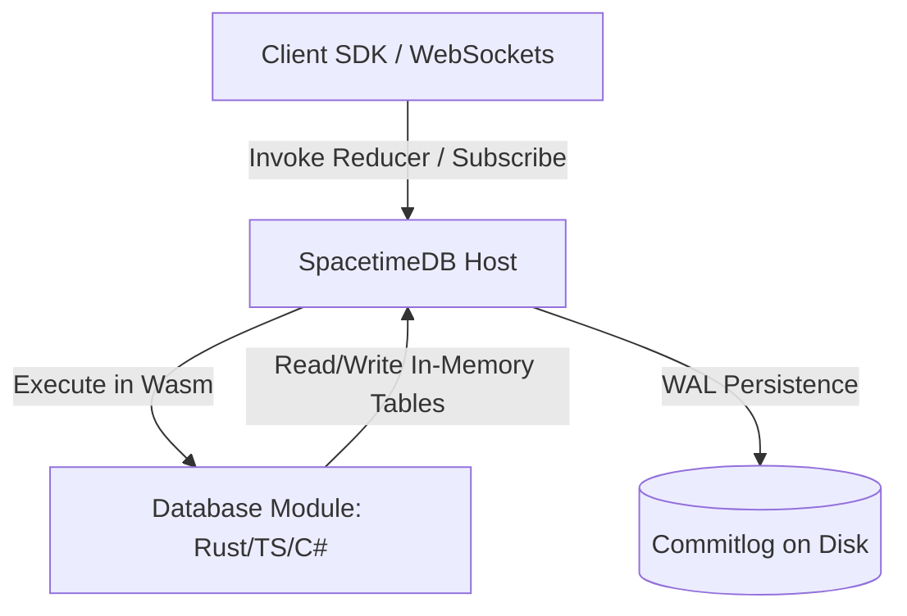

# SpacetimeDB Development

SpacetimeDB is a relational database system that runs your entire application server logic inside the database as WebAssembly (Wasm). Clients connect directly to the database via WebSocket, subscribing to live query updates and invoking server-side transaction-atomic reducers.

## When to Use This Skill

- Creating, writing, or refactoring SpacetimeDB server-side database modules (in Rust, TypeScript, C#, or C++).
- Defining table schemas, indexes, constraints, event tables, and schedule tables.
- Implementing transaction-atomic reducers and read-only views.
- Developing client-side integration using TypeScript, Rust, C#, Unreal Engine, Godot, or Unity.
- Working with the `spacetime` command-line interface (CLI) to develop, run, and publish modules.

## Reference Files

- [llms.txt](resources/llms.txt) — Comprehensive sitemap and entry-point index for the SpacetimeDB developer documentation.

---

## 1. Core Architecture

In SpacetimeDB, the database _is_ the server. You do not write a separate API gateway.



### Key Pillars

1. **In-Memory Speed & Durability**: All database data is stored in memory for microsecond-latency access. Transactions are written to a write-ahead log (Commitlog) on disk for durability and crash recovery.
2. **Serverless Wasm Execution**: All server-side logic (reducers, views) runs sandboxed inside the database engine via WebAssembly.
3. **Real-Time Subscriptions**: Instead of polling or building polling API endpoints, clients subscribe to SQL queries. SpacetimeDB pushes incremental diffs over WebSockets whenever matching data changes.
4. **Transaction Atomicity**: Every reducer execution is an isolated database transaction. If a reducer returns an error or panics, the entire transaction is rolled back.

---

## 2. Table Semantics

Data in SpacetimeDB is stored in tables. You declare tables using macros/decorators in your language of choice.

### Table Configurations & Attributes

- **Public vs. Private**: Tables are private by default — queryable only by server-side code (reducers and views). Add the `public` attribute (`#[table(accessor = <name>, public)]` in Rust) to make a table readable by any connected client.
- **Primary Keys**: Used to uniquely identify rows (`#[primary_key]`).
- **Unique Constraints**: Prevent duplicate values in specified columns (`#[unique]`).
- **Auto-Increment**: Automatically generates unique integer sequences for new rows (`#[auto_inc]`).
- **Indexes**: Accelerate lookups on specific fields (`#[index(btree)]`).

### Special-Purpose Tables

- **Event Tables**: Transient tables designed for notifying clients of instantaneous actions (e.g., "entity took 50 damage") without storing the data permanently on disk. They do not participate in WAL storage.
- **Schedule Tables**: Tables that trigger reducers or procedures at specific times by including a special scheduling column. Perfect for cron tasks, delayed actions, or timeout triggers.

---

## 3. Reducers, Procedures, and Views

Modules expose functions to the outside world. They are classified as follows:

| Feature / Property       | Reducers                  | Procedures               | Views                   |
| :----------------------- | :------------------------ | :----------------------- | :---------------------- |
| **State Mutation**       | Yes (Read/Write)          | No (Read-Only)           | No (Read-Only)          |
| **Transaction Boundary** | Starts a new transaction  | Runs outside or inherits | Read-Only transaction   |
| **Client Invocation**    | Yes (via WS/HTTP)         | Yes (via WS/HTTP)        | Yes (via WS/HTTP)       |
| **Typical Use**          | Modifying state / actions | Complex read workflows   | Aggregating & filtering |

### Reducer Context (`ReducerContext`)

Every reducer receives a context object as its first argument containing:

- `sender`: The `Identity` of the client calling the reducer.
- `db`: The database interface to query/mutate tables.
- `timestamp`: The execution time of the transaction.
- `rng`: A deterministic random number generator.

### Lifecycle Reducers

Special reducers invoked by the database host during system lifecycle events:

- `__init__`: Runs once when the database is first initialized.
- `__connect__`: Runs when a client connects.
- `__disconnect__`: Runs when a client disconnects.
- `__update__`: Runs when a new version of the module is published.

---

## 4. Rust Module Example

Below is a complete, minimal Rust module defining tables and a reducer.

```rust
use spacetimedb::{reducer, table, Identity, ReducerContext, Table};

// Define a public table for user profiles
#[table(accessor = user_profile, public)]
pub struct UserProfile {
    #[primary_key]
    pub identity: Identity,
    pub username: String,
    pub online: bool,
}

// Define a private table for handling timeouts (tables are private by default)
#[table(accessor = heartbeat_timeout)]
pub struct HeartbeatTimeout {
    #[primary_key]
    pub identity: Identity,
    pub scheduled_time: u64,
}

// Reducer called by clients to register or update their username
#[reducer]
pub fn register_user(ctx: &ReducerContext, username: String) -> Result<(), String> {
    if username.trim().is_empty() {
        return Err("Username cannot be empty".to_string());
    }

    if let Some(mut profile) = ctx.db.user_profile().identity().find(ctx.sender()) {
        profile.username = username;
        ctx.db.user_profile().identity().update(profile);
    } else {
        ctx.db.user_profile().try_insert(UserProfile {
            identity: ctx.sender(),
            username,
            online: true,
        })?;
    }

    Ok(())
}

// Connection lifecycle hook
#[reducer(client_connected)]
pub fn identity_connected(ctx: &ReducerContext) {
    if let Some(mut profile) = ctx.db.user_profile().identity().find(ctx.sender()) {
        profile.online = true;
        ctx.db.user_profile().identity().update(profile);
    }
}
```

---

## 5. CLI & Deployment commands

Use the `spacetime` CLI to build, test, and host your modules.

| Command                                                      | Description                                                           |
| :----------------------------------------------------------- | :-------------------------------------------------------------------- |
| `spacetime start`                                            | Starts a local SpacetimeDB standalone database instance.              |
| `spacetime dev`                                              | Starts interactive development mode, auto-publishing changes on save. |
| `spacetime publish <name>`                                   | Compiles your module to Wasm and deploys it to the database.          |
| `spacetime generate --lang <lang> <db-name> --out-dir <dir>` | Generates type-safe client bindings (TypeScript, Rust, C#, C++).      |
| `spacetime logs <db-name>`                                   | Streams server-side execution logs.                                   |

---

## 6. Best Practices

- **Do:** Keep reducers deterministic. Never fetch external web APIs or read system time directly inside a reducer; always use the values provided in `ReducerContext` (e.g. `ctx.timestamp`, `ctx.rng`).
- **Do:** Use event tables for ephemeral real-time updates (e.g., chat messages, position updates in game loops) to save disk I/O and prevent database bloat.
- **Do:** Secure private tables. If a client should not see the data, make the table private.
- **Don't:** Perform long, blocking CPU tasks inside a reducer. Since reducers run in transactions, blocking them halts database throughput.
- **Don't:** Run manual migration scripts for simple additions. SpacetimeDB supports automatic schema migrations for backwards-compatible modifications.
